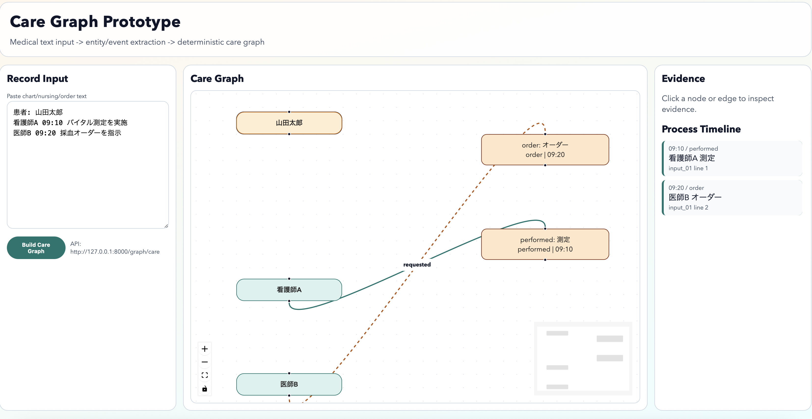

# mito_2026

医療記録テキストから rule-based で構造抽出を行い、  
`Care Graph` と `Process Timeline` を生成・可視化する研究プロトタイプです。

## 目的

- 医療記録を構造化データに変換する
- 抽出結果を決定的にグラフ/タイムラインへ変換する
- 抽出結果と evidence テキストを常に紐付ける

## 非対象

- 診断推定
- 治療提案
- 医療意思決定支援
- 推測によるデータ補完
- 実患者データの利用

## 実装ステータス

- Step1: 医療記録入力（完了）
- Step2: Entity Extraction（完了）
- Step3: Event Extraction（完了）
- Step4: Graph JSON 生成（完了）
- Step5: Timeline 生成（完了）
- Step6: Graph Visualization（完了）
- Step7: UI改善（Evidence/Timelineパネル実装）（完了）

## アーキテクチャ

処理フロー:

`medical text input -> entity extraction -> event extraction -> graph generation -> timeline generation`

設計方針:

- 抽出ロジックは backend に集約
- frontend は可視化のみを担当
- evidence（`record_id`, `line_index`, `text`, `span`）を保持

## ディレクトリ

```text
backend/
  api/          # FastAPI endpoints
  extraction/   # record/entity/event extraction
  graph/        # care graph JSON generation
  timeline/     # process timeline generation
frontend/
  pages/        # Next.js pages
  components/   # React Flow UI components
data/sample_records/
tests/
```

## セットアップ

### Backend

```bash
python3 -m venv .venv
. .venv/bin/activate
pip install -r requirements.txt
uvicorn backend.api.main:app --reload
```

API Docs:

- `http://127.0.0.1:8000/docs`

### Frontend

```bash
cd frontend
npm install
npm run dev -- --hostname 127.0.0.1 --port 3000
```

UI:

- `http://127.0.0.1:3000`

## 画面イメージ

`docs/images/care-graph-ui.png` を配置すると、READMEに画面を表示できます。



## UIでの確認方法

1. 左の `Record Input` に医療記録を入力
2. `Build Care Graph` を押下
3. 中央に Care Graph（React Flow）が表示
4. 右に Evidence と Process Timeline が表示
5. ノード/エッジをクリックすると evidence 詳細を確認可能

## 主要API

- `POST /records/normalize`
- `POST /extraction/entities`
- `POST /extraction/events`
- `POST /graph/care`
- `POST /timeline/process`

`/graph/care` request 例:

```json
{
  "records": [
    {
      "record_id": "sample_01",
      "record_type": "chart",
      "text": "患者: 山田太郎\n看護師A 09:10 バイタル測定を実施\n医師B 09:20 採血オーダーを指示"
    }
  ]
}
```

## テスト / 品質確認

```bash
. .venv/bin/activate
pytest -q
ruff check .
```

## 注意

このリポジトリは研究・開発用途です。  
医療判断を行うシステムとしては使用しないでください。
